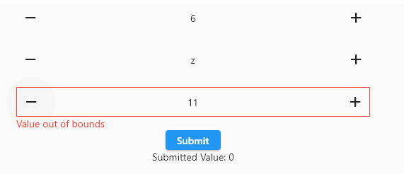

# increment_decrement_form_field

## Increment or decrement a value using spaced horizontal [IconButton](<https://api.flutter.dev/flutter/material/IconButton-class.html>)s wrapped in a [FormField](https://api.flutter.dev/flutter/widgets/FormField-class.html)



## Increment and decrement an integer ([example](./example/lib/main.dart))

```dart
/*
    increment, decrement an int
*/
IncrementDecrementFormField<int>(
    // an initial value
    initialValue: 0,

    // return the widget you wish to hold the value, in this case Text
    // if no value set 0, otherwise display the value as a string
    displayBuilder: (value, field) {
        return Text(
            value == null ? "0" : value.toString(),
        );
    },

    // run when the left button is pressed (decrement)
    // the current value is passed as a parameter
    // return what you want to update the display value to
    // when decrement is pressed. In this case if null 0,
    // otherwise current value -1
    onDecrement: (currentValue) {
        return currentValue! - 1;
    },

    // run when the right button is pressed (increment)
    // the current value is passed as a parameter
    // return what you want to update the display value to
    // when increment is pressed. In this case if null 0,
    // otherwise current value +1
    onIncrement: (currentValue) {
        return currentValue! + 1;
    },
),
```

## Alphabet increment decrement with error checking ([example](./example/lib/main.dart))

```dart
/*
    Alphabet increment decrement with error checking
*/
IncrementDecrementFormField<String>(
    // auto validate set, so validates whenever input changes
    autovalidateMode: AutovalidateMode.always,

    // set an initial value
    initialValue: "a",

    // show the current char
    displayBuilder: (value, field) {
        return Text(
            value!,
        );
    },

    // decrement current charcode by 1
    onDecrement: (currentValue) {
        return String.fromCharCode(
            currentValue!.codeUnitAt(0) - 1,
        );
    },

    // increment current charcode by 1
    onIncrement: (currentValue) {
        return String.fromCharCode(
            currentValue!.codeUnitAt(0) + 1,
        );
    },

    // error if not between a and z lowercase
    validator: (value) {
        if (value == null ||
            value.length != 1 ||
            value.codeUnitAt(0) < "a".codeUnitAt(0) ||
            value.codeUnitAt(0) > "z".codeUnitAt(0)) {
            return "Value out of bounds";
        }
        return null;
    },
),
```

## Increment by 2 decrement by 1 with form and validation valid if between 0 and 10 inclusive ([example](./example/lib/main.dart))

```dart
/*
    increment by 2 decrement by 1 with form and validation
    valid if between 0 and 10 inclusive
*/
StatefulBuilder(
    builder: (context, setState) {
        return Form(
            key: formKey,
            child: Column(
                children: [
                    IncrementDecrementFormField<int>(
                        // auto validate and set init value
                        autovalidateMode: AutovalidateMode.always,
                        initialValue: 0,

                        // show current value
                        displayBuilder: (value, field) {
                            return Text(
                            value!.toString(),
                            );
                        },

                        // decrement by 1
                        onDecrement: (currentValue) {
                            return currentValue! - 1;
                        },

                        // increment by 2
                        onIncrement: (currentValue) {
                            return currentValue! + 2;
                        },

                        // validate if between 0 and 10 inclusive
                        validator: (value) {
                            if (value == null || value > 10 || value < 0) {
                                return "Value out of bounds";
                            }
                            return null;
                        },

                        // add on saved function to set the holder value
                        // when the for calls onSaved
                        onSaved: (value) {
                            holder = value!;
                        },
                    ),

                    // a submit button and display for submitted value
                    // if successful validation set the holder by calling
                    // save
                    ElevatedButton(
                        onPressed: () {
                            if (formKey.currentState!.validate()) {
                                setState(() {
                                    formKey.currentState!.save();
                                });
                            }
                        },
                        child: const Text(
                            "Submit",
                        ),
                    ),

                    // display submitted value
                    Text(
                        "Submitted Value: $holder",
                    ),
                ],
            ),
        );
    },
),
```

## Config Objects

The following config objects are used to pass configs to widgets nested within [IncrementDecrementFormField](./lib/src/increment_decrement_form_field_widget.dart)

- [ColumnConfig](./lib/src/column_config.dart)
- [ContainerConfig](./lib/src/container_config.dart)
- [ErrorFlexibleConfig](./lib/src/error_flexible_config.dart)
- [ErrorTextConfig](./lib/src/error_text_config.dart)
- [IconButtonConfig](./lib/src/icon_button_config.dart)
- [RowConfig](./lib/src/row_config.dart)
